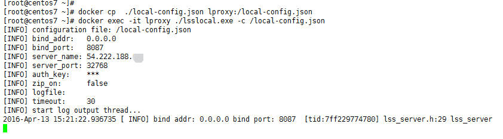

### 利用 [daocloud.io](https://www.daocloud.io/)「胶囊主机」 体验 `lproxy` 远程代理服务

预先准备：

1. 本地需要一个 `lproxy` local 端程序：`lsslocal.exe`。
2. 注册一个 [daocloud.io](https://www.daocloud.io/) 账号。

手把手的图文教程：

1. **第一步：创建试用主机**

	1. **进入 [daocloud.io](https://www.daocloud.io/) 控制台，点击 “我的集群”。**

		

	2. **在“自有集群”中添加主机。**

		

	3. **选择“试用”。**

		 

	4. **点击“创建”。**

		

	5. **“查看新主机”。**

		

	6. **“Try_DaoCloud_1” 「胶囊主机」创建完毕。**

		

2. **第二步：创建 lproxy 应用**

	1. **进入[daocloud.io](https://www.daocloud.io/) 控制台，点击“应用管理”。**

		

	2. **“创建应用”。**

		

	3. **选择“DockerHub镜像”，并搜索 `deel/lproxy`。**

		

	4. **部署 `deel/lproxy`。**

		

	5. **“部署最新版本”。**

		

	6. **取名 `lproxy` , 在“我的主机”里面选中刚刚创建的主机“Try_DaoCloud_1”。**

		

	7. **配置“基础设置”。**

		

	8. **点击 “+ Add Port”。**

		

	9. **添加 TCP `8088` 端口。**

		

	10. **配置“高级设置”。**

		

	11. **指定容器启动命令 `./lssserver.exe -k`, 并“ 立即部署”。**

		

3. **第三步：配置本地 local 端配置文件**

	1. **获取服务端 ip 和 port。**

		**进入控制台，点击“我的集群”，“自有集群”中点击“管理主机”, 进入“Try_DaoCloud_1” 主机管理页面。也就是第一步进入的那个页面。记下外网 ip 和 映射的端口。**

		

	2. **将本地 local 端配置文件`local-config.json` 中的 `server_name` 和 `server_port` 分别改成刚才记下的 ip 和 端口。**

		

	3. **启动 local 端程序 `./lsslocal.exe -c /path/to/local-config.json`。**

		*下图只是 local 端用 docker 启动的示例，可选择其他方法启动 `lsslocal.exe`*

		

4. **第四步：查明 `lsslocal.exe` 所在主机的 ip，然后让你的应用软件走 local 端的 Socks5 网络代理，比如 `socks5://127.0.0.1:8087`。**

	**ip 已更改，大功告成**

	