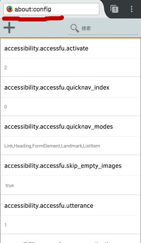
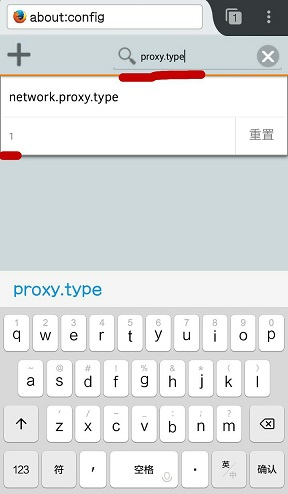
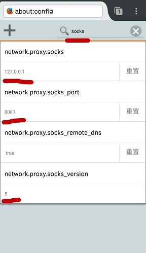

### 在 Android 平台下的 Firefox 浏览器设置 socks5 代理方法

1. 第一步：

    在地址栏中输入 "about:config" 并确定。

    

2. 第二步：

    在搜索栏中搜索 "proxy.type"，并将出现的 "network.proxy.type" 的值设置为 `1`。（默认值为 `5`， 表示“系统代理”；`1` 表示“手动开启代理”）

    

3. 第三步：
    
   在搜索栏中搜索 "socks"，并修改相应的值：

	1. `network.proxy.socks` 为目标服务器地址；
    2. `network.proxy.socks_port` 为目标服务器端口号；
    3. `network.proxy.socks_remote_dns` 值为 `true` 代表让 DNS 走 socks远程代理；
    4. `network.proxy.socks_version` 为 Socks 版本， `5` 代表 `Socks5`。

    假如 lproxy 设置 socks5 服务器地址为： socks5://127.0.0.1:8087

    

这样就设置完成了。